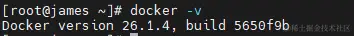
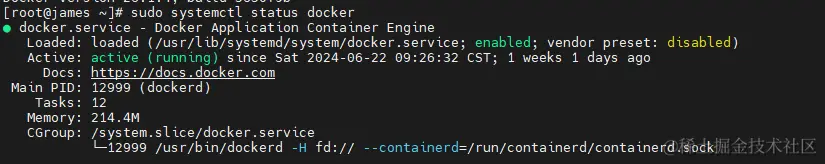
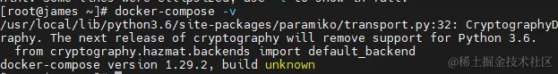
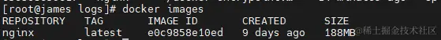
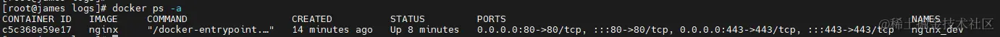
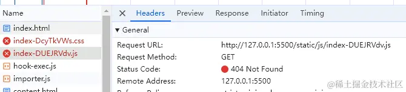

# Docker部署nginx发布前端项目

## 前言

> 本文使用docker部署nginx，并发布前端项目。本文会让你了解：
>
> 1.  安装docker和docker-compse
> 2.  编写docker-compose文件
> 3.  nginx配置文件设置
> 4.  部署项目

## 1\. 安装docker、docker-compose、nginx

本文都是以阿里云服务器为例，[docker安装文档](https://help.aliyun.com/zh/ecs/use-cases/install-and-use-docker-on-a-linux-ecs-instance?spm=5176.12818093_-1363046575.help.dexternal.232e16d0mvSjEF&scm=20140722.S_help%40%40%E6%96%87%E6%A1%A3%40%4051853.S_RQW%40ag0%2Bos%2BBB2%40ag0%2BBB1%40ag0%2Bhot.ID_51853-RL_docker%E5%AE%89%E8%A3%85-LOC_console~UND~help-OR_ser-V_3-P0_0#2afc861105osq "https://help.aliyun.com/zh/ecs/use-cases/install-and-use-docker-on-a-linux-ecs-instance?spm=5176.12818093_-1363046575.help.dexternal.232e16d0mvSjEF&scm=20140722.S_help%40%40%E6%96%87%E6%A1%A3%40%4051853.S_RQW%40ag0%2Bos%2BBB2%40ag0%2BBB1%40ag0%2Bhot.ID_51853-RL_docker%E5%AE%89%E8%A3%85-LOC_console~UND~help-OR_ser-V_3-P0_0#2afc861105osq")。

### 1.1 安装docker

主要步骤如下：

1.  下载docker-ce的yum源

```bash
sudo wget -O /etc/yum.repos.d/docker-ce.repo https://mirrors.aliyun.com/docker-ce/linux/centos/docker-ce.repo
```

2.  运行以下命令，安装Docker。

```auto
sudo yum -y install docker-ce
```

3.  检查Docker是否安装成功。

```auto
docker -v
```



4.  启动Docker服务，并设置开机自启动。

```bash
sudo systemctl start docker
sudo systemctl enable docker
```

5.  查看Docker是否启动。

```lua
sudo systemctl status docker
```



### 1.2 安装docker-compose

docker-compose是Docker官方提供的用于定义和运行多个Docker容器的开源容器编排工具，可以使用YAML文件来配置应用程序需要的所有服务，然后使用docker-compose运行命令解析YAML文件配置，创建并启动配置文件中的所有Docker服务。

主要步骤如下：

1.  运行以下命令，安装setuptools。
    
    ```auto
    sudo pip3 install -U pip setuptools
    ```
    
2.  运行以下命令，安装docker-compose。
    
    ```auto
    sudo pip3 install docker-compose
    ```
    
3.  运行以下命令，验证docker-compose是否安装成功。
    
    ```css
    docker-compose --version
    ```
    



如果回显返回docker-compose版本信息，表示docker-compose已安装成功。

> 注意：如果安装中缺少依赖，需要安装`sudo yum install epel-release`和`sudo yum install python3-pip`

### 1.3 下载nginx镜像

安装nginx镜像，需要先设置镜像源，否则会出现拉取不下来情况。

可参考上一篇文章[三分钟！快速解决Dockerhub镜像站无法访问问题！](https://juejin.cn/post/7382484880288399397 "https://juejin.cn/post/7382484880288399397")

主要步骤如下：

1.  拉取镜像

```auto
docker pull nginx
```

2.  检查是否拉取成功

```auto
docker images
```



至此，docker和docker-compose、nginx均已下载安装完成。

## 2\. 启动nginx

接下来主要进行文件编写，和启动容器。

### 2.1 编写docker-compose.yaml启动文件

docker-compose.yaml

```yaml
version: '3'

networks:
  frontend:
    external: true

services:                                      # 容器
  docker_nginx_dev:                            # nginx-dev环境
    restart: always
    image: nginx
    container_name: nginx_dev
    ports:
      - 80:80
      - 443:443
    volumes:
      - /docker/nginx/conf/nginx.conf:/etc/nginx/nginx.conf
      - /docker/html:/usr/share/nginx/html
      - /docker/nginx/logs:/var/log/nginx
      - /docker/nginx/conf/conf.d:/etc/nginx/conf.d
```

需要新建文件夹

+   /docker/nginx/conf：放入nginx配置文件
+   /docker/html：放置静态文件
+   /docker/nginx/logs：nginx日志
+   /docker/compose: docker-compose启动文件
+   /docker/nginx/conf/conf.d:/etc/nginx/conf.d ： 所有的配置文件

volumes:主要将容器内的文件挂载到宿主机上，方便配置。如何确定容器内文件的目录位置，可进入容器内，使用`whereis nginx`查看


+   /etc/nginx ：配置文件位置
+   /usr/share/nginx : 静态资源位置

### 2.2 编写nginx.conf文件

nginx.conf

```bash
user  nginx;
worker_processes  auto;

error_log /var/log/nginx/error.log notice;
pid /var/run/nginx.pid;


events {
    worker_connections  1024;
}


http {
    include /etc/nginx/mime.types;
    default_type  application/octet-stream;

    log_format  main  '$remote_addr - $remote_user [$time_local] "$request" '
    '$status $body_bytes_sent "$http_referer" '
    '"$http_user_agent" "$http_x_forwarded_for"';

    access_log /var/log/nginx/access.log  main;

    sendfile        on;
    #tcp_nopush     on;

    keepalive_timeout  65;
    gzip  on;
    gzip_buffers 16 8k;
    gzip_comp_level 6;
    gzip_http_version 1.1;
    gzip_min_length 256;
    gzip_proxied any;
    gzip_vary on;
    gzip_types
      text/xml application/xml application/atom+xml application/rss+xml application/xhtml+xml image/svg+xml
      text/javascript application/javascript application/x-javascript
      text/x-json application/json application/x-web-app-manifest+json
      text/css text/plain text/x-component
      font/opentype application/x-font-ttf application/vnd.ms-fontobject
      image/x-icon;
    gzip_disable  "msie6";

    include /docker/nginx/conf/conf.d/*.conf;
    
    server {
        #监听的端口
        listen  80;
        server_name  localhost;
        #设置日志
        access_log  /var/log/nginx/dev.access.log  main;        
        #定位到index.html
        location / {
            #linux下HTML文件夹,就是你的前端项目文件夹  /docker/html映射到容器内部
            root /usr/share/nginx/html;
            #输入网址（server_name：port）后，默认的访问页面
            index  index.html;
            try_files $uri $uri/ /index.html;
        }
    }

}
```

具体主要是指定访问的根路径和日志的位置。目前暂时全部写在nginx.conf下，后面会展示不同项目使用单独的conf文件进行配置。

### 2.3 部署前端项目

将`/docker/html`文件夹下放入静态文件html。

### 2.4 运行

需进入docker-compose.yaml文件下

```auto
docker-compose up -d
```

启动后如下：



## 3\. nginx部署项目一些问题

### 3.1 vue项目打包文件base设置

为什么设置了`./`就能访问，我们看一个案例。

#### 案例：本地打包后的文件，通过live server启动：

1.  设置为`/`绝对路径

打包后的引入路径为：

```ini
<script type="module" crossorigin src="/static/js/index-CYTZDwzX.js"></script>
<link rel="stylesheet" crossorigin href="/static/css/index-DcyTkVWs.css">

```

如果直接在项目下的dist启动文件，会出现



这是因为启动的服务器根目录项目的入口，如vite.config.ts这些文件是可以访问到的，dist文件下的文件，并不在根目录下。同理，服务器也是相同，你的资源文件不是根目录下。

2.  设置为`./`相对路径

打包后的引入路径为：

```ini
<script type="module" crossorigin src="./static/js/index-CYTZDwzX.js"></script>
<link rel="stylesheet" crossorigin href="./static/css/index-DcyTkVWs.css">
```

此时寻找的路径就是以dist为目录，相对路径可以找到对应的文件

## 4\. 总结

最后总结一下，主要介绍了使用 Docker 和 Docker-compose 部署 Nginx 并发布前端项目的全过程。下一次总结下同一个nginx下部署多个项目。

